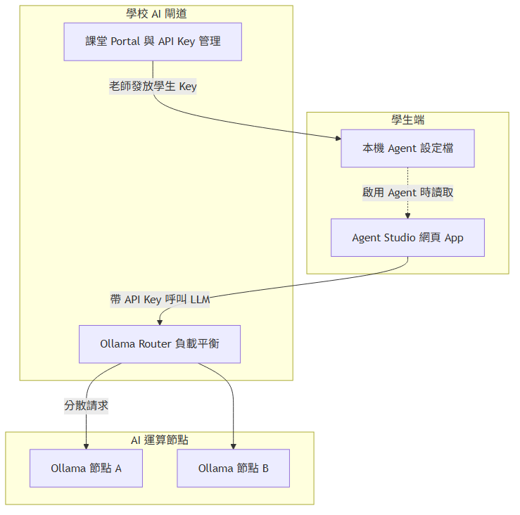
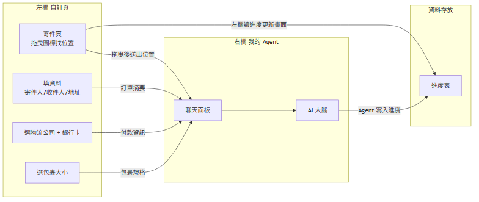
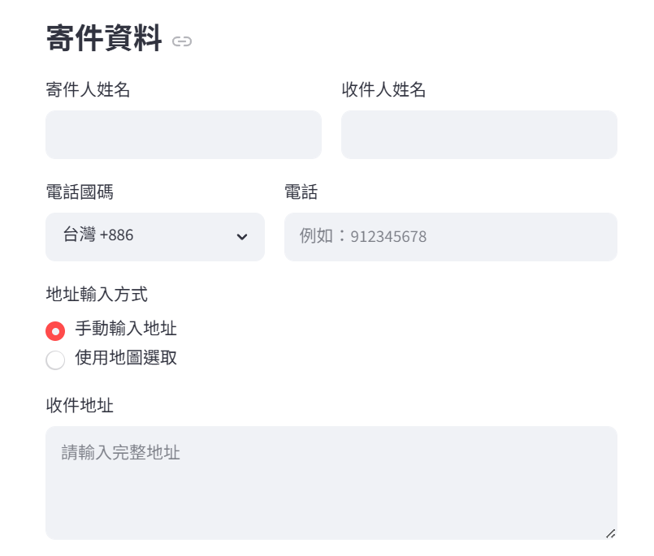

# 送貨 App 的進步

**組別／組員**：{組別}  
**日期**：2026-06-24

---

## 1. 專題介紹

- **專題名稱**：送貨 App 的進步
- **一句話**：可以拿來迅速填送貨進度
- **主要使用者**：想要寄貨的人
- **想解決的問題**：可以直接在這個 App 選擇想要的物流公司，並迅速寄貨

---

## 2. 學校 Server 環境

本專題透過學校提供的 API Key 呼叫 Ollama Router，由 Router 分配至後端 Ollama 節點執行 LLM。下圖為全班相同之 server 拓撲（報告不標示 Router 位址）。

---

## 3. 系統概覽

左欄 Streamlit 自訂頁與右欄 Agent 的互動如下。

- **左欄自訂頁欄位**：寄件人、收件人、地址、送貨包裹大小限制、銀行卡等
- **左欄傳給 Agent**：訂單、物流公司、銀行卡
- **Agent 寫回**：進度表
- **完整例子**：使用者拖曳圖標找到自家位置 → Agent 回傳經緯度（註：只是其中一個例子）

---

## 4. 成果與創新

### 4.1 成果

- 選物流公司
- 填資料（寄件人／收件人／地址）
- 銀行卡付款
- 選包裹大小

### 4.2 創新／亮點

- 人們不用去各大物流公司一一對比，在這個 App 就能直接選想要的物流公司

---

## 5. 技術含量

- 地圖（map）的完善程度算不錯

---

## 附錄：Demo 截圖

### 寄件

---

展覽用綜整海報（Step 7 另產）：`assets/專題海報.png`